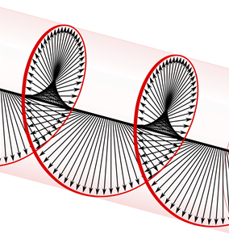

 

  
  <h1 align="center">Polarization toolbox
</h1>
    

Toolbox for simple discription of a polarazers and a polarization controllers.
  

## Usage
See the [example](example.m) .

## List of functions
See the [list of functions](list_of_functions.md) .

## License
Distributed under the MIT License. See [`LICENSE`](LICENSE) for more information.

## Contact
Project Link: [alekseikukin/polcon](https://github.com/alekseikukin/polcon) .

